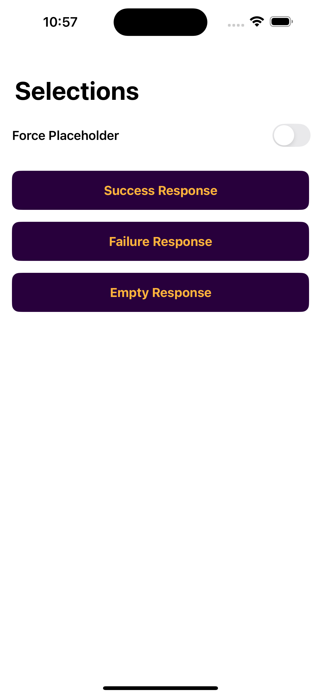
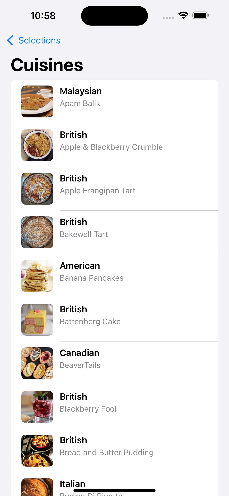
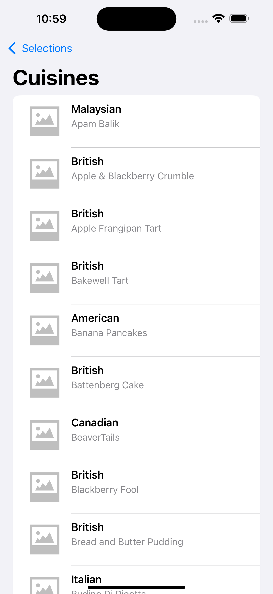
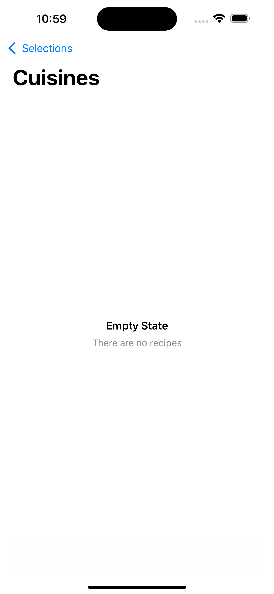
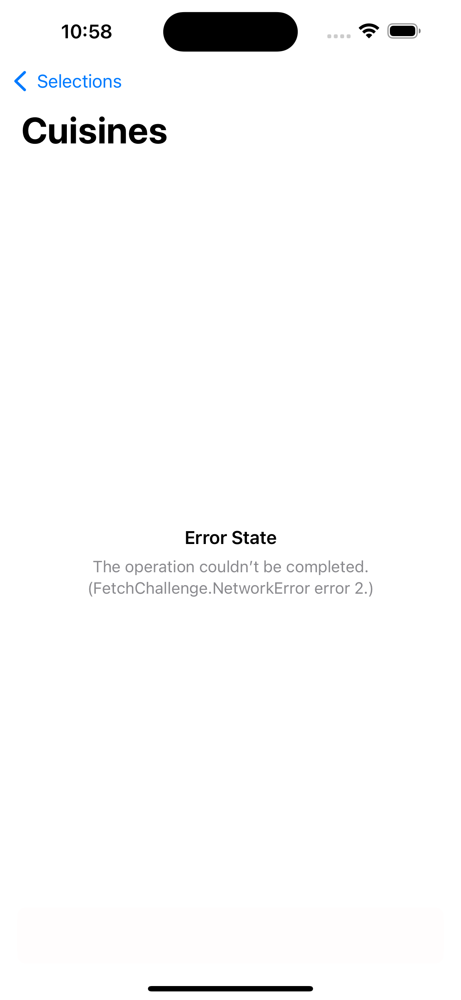

# Fetch Challenge

## Summary
This is a SwiftUI-based iOS app that fetches and displays recipes. It leverages the Model-View-ViewModel (MVVM) architecture, async/await, dependency injection, and more!  
Key features include:
- ViewModel-driven UI with testable business logic
- Custom UI with success, empty, and error states (including a Toast!)
- Reusable components
- Native image caching
- `MockNetworkService` for testing

## Screenshots

### Selection View

### Home View - Success

### Home View - Success with Placeholder

### Home View - Empty State

### Home View - Error State

---

## Focus Areas
- **Ease of Use**: Created a `SelectionView` that allows users to easily choose which endpoint to hit.
- **Architecture**: Leveraged MVVM, dependency injection, and protocol-oriented design for separation of concerns, reusability, and improved testability.
- **Image Caching**: Built a lightweight image caching system using `URLCache` and a custom `CachedAsyncImage` view.
- **Concurrency**: Used Swift’s async/await APIs throughout the app.
- **Mocking**: Added `MockNetworkService`, mock JSON files, and a mock data loader to simulate API scenarios (success, empty, malformed).

---

## Time Spent
Roughly 8 hours:
- 2 hours on UI
- 2 hours on networking, mocking, and decoding
- 1 hour on `CachedAsyncImage`
- 2 hours writing and refining tests
- 1 hour for polishing and README

---

## Trade-offs and Decisions
- **Minimal UI**: Focused time on architecture and testing instead of animations or UI customization.

---

## Weakest Part of the Project
- **Minimal UI**: See above ^^^. If I had more time I would've wanted to have added more fancy shmancy visuals and animations.

---

## Additional Information
- A toggle that turns on/off a placeholder image for all images.

---

## How to Run
1. Open the Xcode project
2. Run on an iOS 17+ simulator
